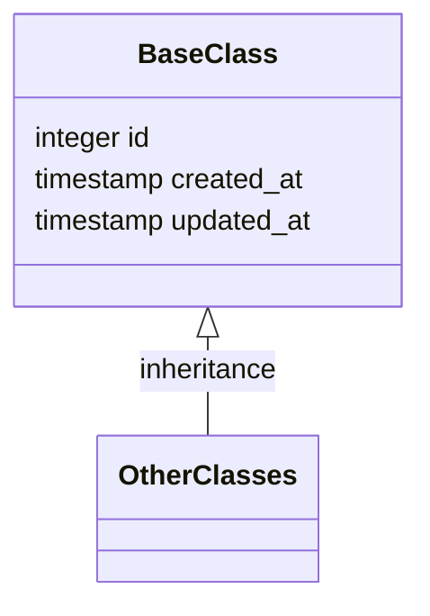
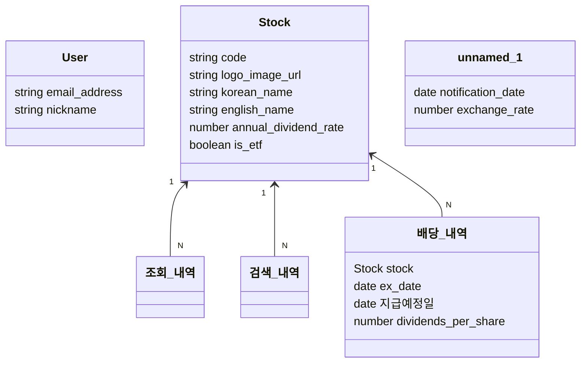

# class diagram

## Notes
* The data types used in the definitions below may differ from the actual data types of the DBMS.

```mermaid
classDiagram
  class BaseClass {
    integer id
    timestamp created_at
    timestamp updated_at
  }
  class OtherClasses
  BaseClass <|-- OtherClasses : inheritance
```

```mermaid
classDiagram
  class User
  %% A unique value with a one-to-one correspondence with the class, independent of the primary key.
  User : string email_address
  User : string nickname

  class Stock
  %% A unique value with a one-to-one correspondence with the class, independent of the primary key.
  Stock : string code
  Stock : string logo_image_url
  Stock : string korean_name
  %% It is not exposed in the UI, but is included in the search target.
  Stock : string english_name
  Stock : number annual_dividend_rate
  Stock : boolean is_etf

  class unnamed_1 {
    date notification_date
    number exchange_rate
  }

  class 조회_내역
  Stock "1" <-- "N" 조회_내역

  class 검색_내역
  Stock "1" <-- "N" 검색_내역

  class 배당_내역 {
    Stock stock
    date ex_date
    date 지급예정일
    number dividends_per_share
  }
  Stock "1" <-- "N" 배당_내역
```
