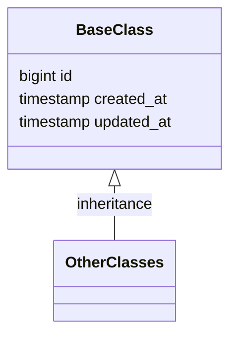

# class diagram

```mermaid
classDiagram
  class BaseClass {
    bigint id
    timestamp created_at
    timestamp updated_at
  }
  class OtherClasses {
  }
  BaseClass <|-- OtherClasses : inheritance
```
