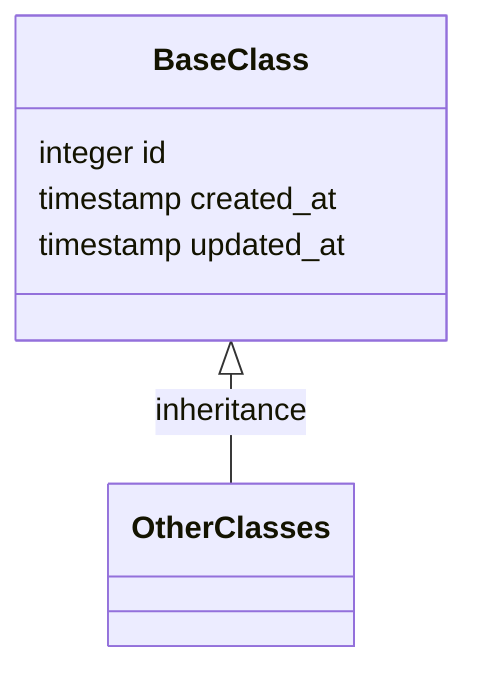
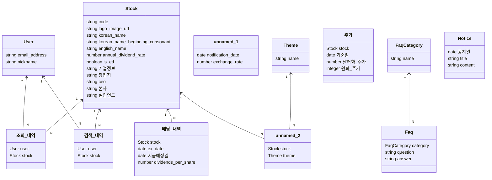

# class diagram

## Notes
* Some of the defined object relationships may be missing.
* The data types used in the definitions below may differ from the actual data types of the DBMS.

```mermaid
classDiagram
  class BaseClass {
    integer id
    timestamp created_at
    timestamp updated_at
  }
  class OtherClasses
  BaseClass <|-- OtherClasses : inheritance
```

```mermaid
classDiagram
  class User
  %% A unique value with a one-to-one correspondence with the class, independent of the primary key.
  User : string email_address
  User : string nickname

  class Stock
  %% A unique value with a one-to-one correspondence with the class, independent of the primary key.
  Stock : string code
  Stock : string logo_image_url
  Stock : string korean_name
  %% It is not exposed in the UI, but is included in the search target.
  Stock : string korean_name_beginning_consonant
  %% It is not exposed in the UI, but is included in the search target.
  Stock : string english_name
  Stock : number annual_dividend_rate
  Stock : boolean is_etf
  Stock : string 기업정보
  Stock : string 창업자
  Stock : string ceo
  Stock : string 본사
  Stock : string 설립연도

  class unnamed_1 {
    date notification_date
    number exchange_rate
  }

  class 조회_내역 {
    User user
    Stock stock
  }
  User "1" <-- "N" 조회_내역
  Stock "1" <-- "N" 조회_내역

  class 검색_내역 {
    User user
    Stock stock
  }
  User "1" <-- "N" 검색_내역
  Stock "1" <-- "N" 검색_내역

  class 배당_내역 {
    Stock stock
    date ex_date
    date 지급예정일
    number dividends_per_share
  }
  Stock "1" <-- "N" 배당_내역

  class Theme {
    string name
  }

  class unnamed_2 {
    Stock stock
    Theme theme
  }
  Stock "1" <-- "N" unnamed_2
  Theme "1" <-- "N" unnamed_2

  class 주가 {
    Stock stock
    date 기준일
    number 달러화_주가
    integer 원화_주가
  }

  class FaqCategory {
    string name
  }

  class Faq {
    FaqCategory category
    string question
    string answer
  }
  FaqCategory "1" <-- "N" Faq

  class Notice {
    date 공지일
    string title
    string content
  }
```
